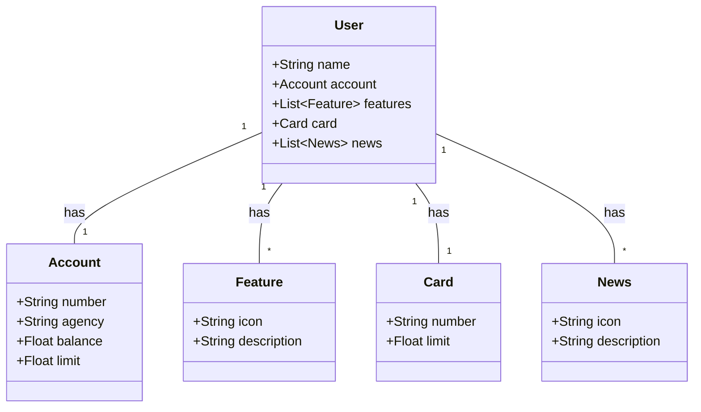

# Projeto Java API RESTful criada para o desafio da DIO

## Diagrama de Classes

## Explicação

- **User:** Representa o usuário principal e contém um nome, uma conta, uma lista de features, um cartão e uma lista de notícias.
- **Account:** Representa a conta do usuário com número, agência, saldo e limite.
- **Feature:** Representa uma funcionalidade com um ícone e uma descrição.
- **Card:** Representa o cartão do usuário com número e limite.
- **News:** Representa uma notícia com um ícone e uma descrição.

As setas e a multiplicidade (como "1" e "*") indicam as relações entre o usuário e seus componentes.
